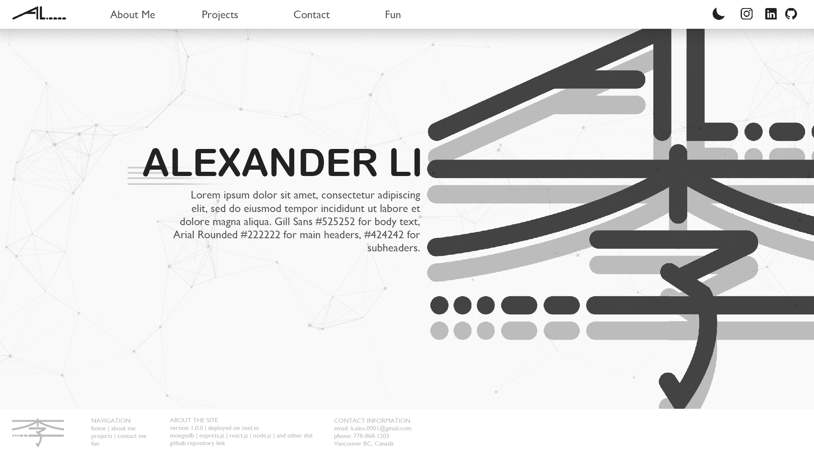

# MERN-Portfolio-Dev


Welcome to the repo for my portfolio website. Follow my

## Changelog

### v2.0.0-b

Begining site redesign

### v1.0.0-b

I wanted to get this thing hosted, so I finished the home page and made a WIP logo for any pages that I have not completed.

[See the site here](https://www.alexli.tech/)

Only the front-end portion is deployed on Netlify since the page that will acutally use the api and call from MongoDB is not fully completed, I considered Vercel but since I used it for the MountainMadness hackathon I wanted to try something new.

I initially wanted to create a theme button to switch between a light and dark mode, but that seems to be a bit too much at the moment. Perhaps in the future. I do have some idea for how to implement it with redux, but I would also have to create a colour pallet and create a new set of logos which I don't want to do yet.

### v0.1.1-b

- Footer completely implemented, responsive to mobile devices and small windows
- Set up environmental variables

```
PORT = ###
CONNECTION_URL = ****
```

### v0.1.0-b

First commit after doing some work on the front end and figuring out how to set up and communicate between the front and back end. Huge thanks to the tutorials from [JavaScript Mastery](https://www.youtube.com/channel/UCmXmlB4-HJytD7wek0Uo97A) as it would have been much more difficult to figure out everything from just reading documentation.

Major additions:

- Header bar added and fully implemented
  - (additional links and darkmode function to be implemented later)
- Footer Added
  - wip, but dynamic scaling has been implemented
- Set up file structure
- Logos animated
  - Credits to the [SVGO](https://github.com/svg/svgo) and [Vivus](https://github.com/maxwellito/vivus) libraries/tools for cleaning my svg and animating.
